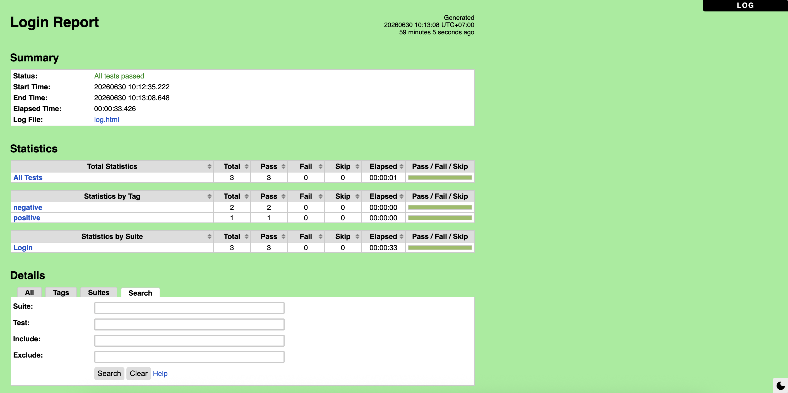
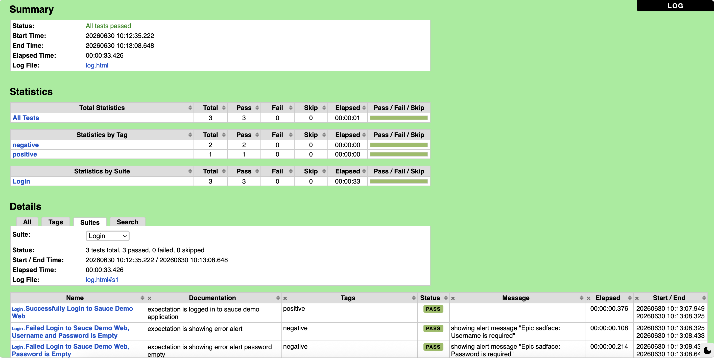
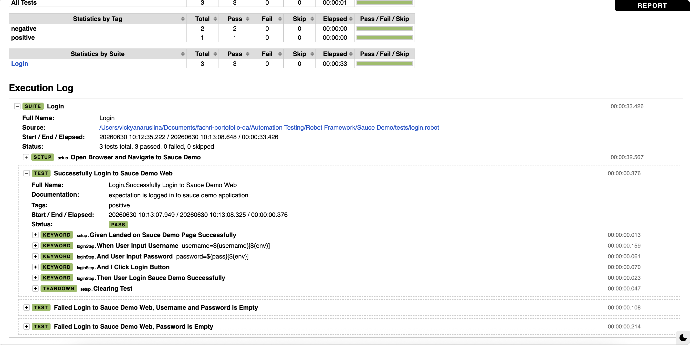

# Robot Framework - Sauce Demo Automation

Automation testing menggunakan Robot Framework dengan SeleniumLibrary pada website Sauce Demo.

## 🌐 Platform

- Websites

## 🛠️ Tech Stack

- Robot Framework 7.4.2
- SeleniumLibrary 6.9.0
- Python 3.10
- Chrome Browser
- VS Code Editor
- Github Version Control

## 🔌 VS Code Extension

- *RobotCode - Robot Framework Support v2.6.2 by Daniel Biehl*

## 📂 Project Structure

```text
.
├── config/
├── resources/
│   ├── keywords/
│   ├── locators/
│   ├── utils/
├── reports/
├── tests/
├── data/
└── README.md
```

## 🚀 Installation

- this is for robotframework installation

```bash
pip install robotframework
```

- this is for selenium library

```bash
pip install robotframework-seleniumlibrary
```

## ▶️ Run Test

Run all test cases:

```bash
robot tests/
```

Run login test only:

```bash
robot tests/login.robot
```

## 📊 Test Reports

After executing the test suite, Robot Framework generates the following reports:

| File | Description |
|------|-------------|
| `report.html` | Test execution summary |
| `log.html` | Detailed execution log |
| `output.xml` | Test execution result in XML format |

### Summary Report





## 👨‍💻 Author

### Fachri Firmansyah Hutagalung